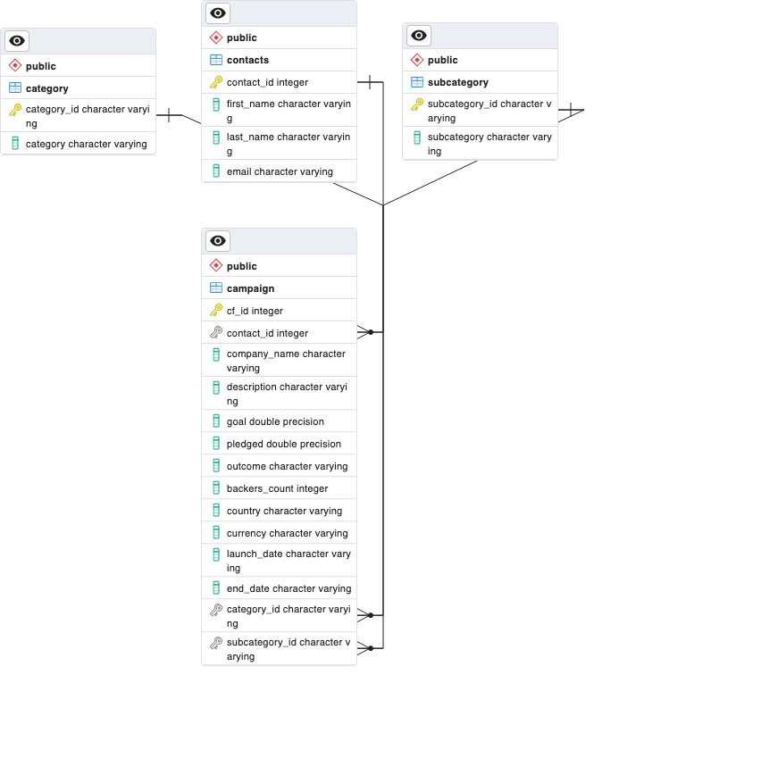

# Crowdfunding ETL Project

## Extraction

The data we extracted for this project was stored on two excel files:
  
  1. crowdfunding.xlsx
  2. contacts.xlsx

## Transform

From crowdfunding.xlsx, we transformed the data into three dataframes (category, subcategory, and campaign). The category and subcategory tables were populated with two columns (category_id/subcategory_id, category/subcategory), with the primary purpose of being used in the normalization of our data within our database.

In addition to these two tables, we created a parent dataframe, campaign, that housed most of the crowdfunding campaign information. In the transformation phase, we added columns for category and subcategory ids as well as converting some of the columns' datatypes into more their appropriate types.

From the contacts.xlsx, we took a "dirty" excel file and, by importing json, pulled the information apart and put it into four columns (contact_id, first_name, last_name, email).

All of these dataframes were exported as csv files.

## Load

With the exported csv files, using pgadmin, we created a database, Crowdfunding, set up the appropriate tables, and populated the tables with the appropriate data. We ran some queries to verify that the data had then loaded correctly. Below is our ERD graph.

